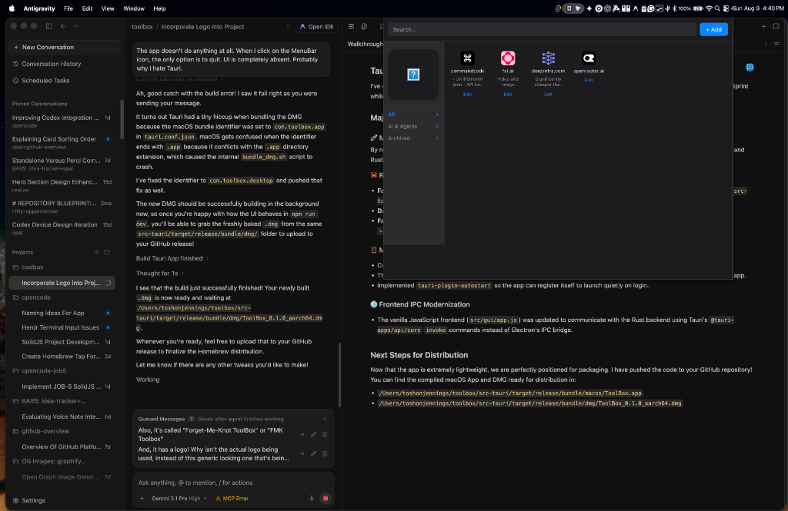

#  Forget-Me-Knot ToolBox

A visual dashboard of every tool you've signed up for — especially the ones you forgot you had. Forget-Me-Knot ToolBox is a lightweight, local-first menu bar app for macOS. Add the tools and services you use, and they stay one click away even when you haven't opened them in weeks.

## Features

- **Menu Bar Access**: Quickly view your dashboard from anywhere on your Mac.
- **Local-First Storage**: Your data never leaves your machine. No passwords or credentials are stored.
- **Favicon Auto-Fetching**: Simply add a URL and Forget-Me-Knot ToolBox grabs the site's favicon for instant visual recognition.
- **Categories & Notes**: Organize your tools into areas (e.g., AI, Dev, Productivity, Learning) and add quick notes like renewal dates or pricing.
- **Quick Launch**: Open any service straight from your dashboard in one click.

---

## Installation (macOS Homebrew)

Install or update **Forget-Me-Knot ToolBox** directly via Homebrew Cask:

### Quick Install / Reinstall & Launch

```bash
brew reinstall --cask toshon-jennings/tap/fmk-toolbox
xattr -cr "/Applications/Forget-Me-Knot ToolBox.app"
open "/Applications/Forget-Me-Knot ToolBox.app"
```

*(For first-time installs, `brew install --cask toshon-jennings/tap/fmk-toolbox` can also be used).*

---

## Development & Building from Source

### Prerequisites

- Node.js (v20+)
- npm
- Rust & Cargo (`rustup`)

### Local Setup

1. Clone the repository:
   ```bash
   git clone https://github.com/toshon-jennings/forget-me-knot.git toolbox
   cd toolbox
   ```
2. Install dependencies:
   ```bash
   npm install
   ```
3. Run in development mode:
   ```bash
   npm run tauri dev
   ```
4. Build release bundle:
   ```bash
   npm run tauri build
   ```
